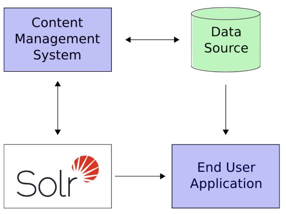

## solr在实际项目中的集成

1. 定义一个schema.xml
2. 部署solr
3. 添加用户希望搜索的数据
4. 在你的应用程序暴露搜索功能

因为Solr是基于开放标准，它是高度可扩展的。 Solr查询是RESTful的，这意味着本质上，查询是一个简单的HTTP请求URL，响应是一个结构化文档：主要是XML，
但也可以是JSON，CSV或其他格式。 这意味着各种各样的客户将能够使用Solr，从其他Web应用程序到浏览器客户端，各种客户端应用程序和移动设备。 任何
能够使用HTTP的平台可以与Solr通信。

Solr是基于Apache Lucene项目，一个高性能，全功能的搜索引擎。 Solr支持最简单的关键字搜索到多个字段上的复杂查询和分面搜索结果。

如果Solr的功能不够令人印象深刻，那么处理非常大批量应用程序的能力应该如此诀窍。

一个相对常见的情况是，您拥有单个Solr服务器的数据或许多查询无法处理您的整个工作负载。在这种情况下，您可以扩展应用程序的功能
使用SolrCloud来更好地分发数据，并在许多服务器上处理请求。多种选项可以根据您需要的可扩展性的类型进行混合和匹配。

例如：“Sharding”是一种缩放技术，其中集合被分成多个逻辑片段“shards”，以便扩大一个集合中的文档数量，超出了实际适用的文件数量
单一服务器。接收的查询分发到集合中的每个分片，并合并每个分片的结果。另一种可用的技术是增加你的集合的“复制因子”，这允许
您可以添加具有附加副本的服务器来处理更高的并发查询负载将请求传播到多台机器。分片和复制不是相互排斥的，
这使Solr成为一个非常强大和可扩展的平台。

最重要的是，这个关于大量应用的讲话不仅仅是假设：一些着名的互联网
今天使用Solr的网站是Macy's，EBay和Zappo

注：以上来自google翻译
